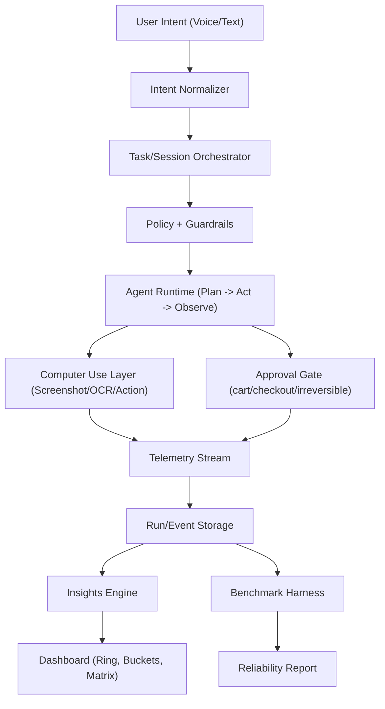
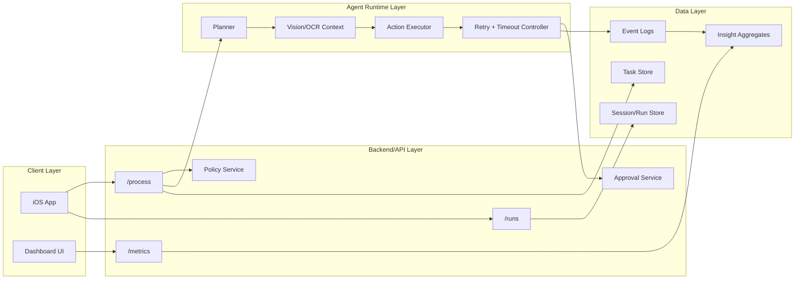
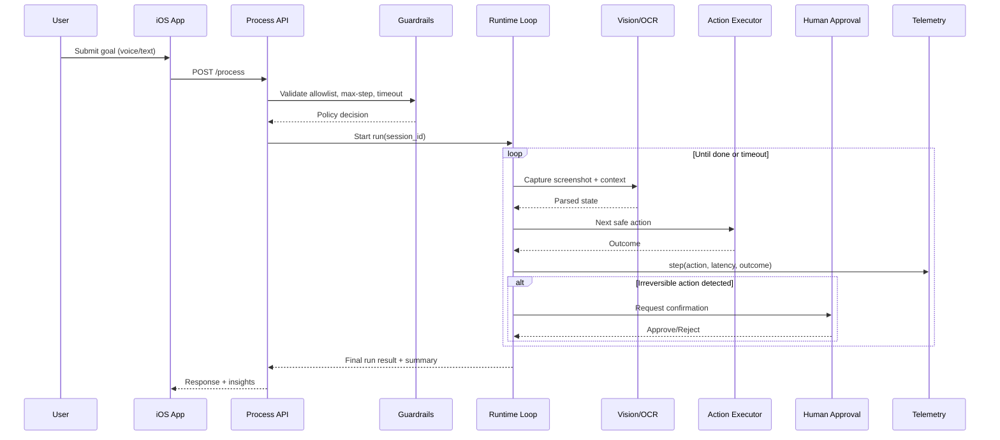

# TimeBite
Previously called CYRA (Creating Your Reality Agent), TimeBite is an Apple Vision Claw-style productivity agent with a measurable eval/benchmark loop for computer-use tasks.


## TL;DR
TimeBite captures user intent (voice/text), plans safe computer actions, runs guarded execution loops, and reports time-reclaimed outcomes through dashboard metrics and benchmark runs.

## Product Goals
- Build an iOS-first agentic productivity experience.
- Enforce safe execution with policy checks and human approvals.
- Benchmark reliability under perturbations (popups, layout shifts, out-of-stock states).
- Quantify value through `minutes_reclaimed` and scenario success metrics.

## Information Architecture


## System Design


## Agent Loop (Execution + Safety)


## Planned API Surface
| Endpoint | Method | Purpose |
|---|---|---|
| `/process` | `POST` | Start/continue an agent run from structured intent. |
| `/runs` | `GET` | Fetch run history, statuses, and scenario results. |
| `/metrics` | `GET` | Return dashboard metrics (time reclaimed, reliability, safety). |

## Core Data Model (Planned)
| Entity | Key Fields |
|---|---|
| `Task` | `task_id`, `intent`, `constraints`, `priority`, `created_at` |
| `Session` | `session_id`, `user_id`, `start_time`, `end_time`, `status` |
| `Run` | `run_id`, `session_id`, `scenario`, `score`, `duration_ms`, `result` |
| `Insight` | `insight_id`, `session_id`, `minutes_reclaimed`, `bucket`, `created_at` |
| `StepEvent` | `run_id`, `step_index`, `action`, `latency_ms`, `outcome`, `safety_flag` |

## Safety and Compliance Defaults
- Allowlist-based action policy.
- Max steps per run and strict wall-clock timeout.
- Mandatory human confirmation for checkout/cart/final submit.
- Benchmark-time perturbation tests before release freeze.

## Metrics That Matter
- `minutes_reclaimed` per run/day/week.
- Success rate across scored benchmark sessions.
- Unsafe action rate under perturbation.
- Median latency per action and end-to-end run time.

## Quick Start (Boilerplate)
```bash
# 1) Clone
git clone https://github.com/erinjerri/TimeBite.git
cd TimeBite

# 2) Create env file (example)
cp .env.example .env

# 3) Install deps
# npm install

# 4) Run app/api
# npm run dev
```

> Note: this repository is currently documentation-first. Replace placeholder setup commands with your actual stack commands as implementation lands.

## Documentation
- Roadmap checklist: `docs/to-do-list.md` (or below section in this README).
- Architecture and safety baseline: this README.

## Build Plan Checklist

| Done | Date | Focus | Task Snippet |
|---|---|---|---|
| - [ ] | Thu Feb 12 | Scope | "Lock iOS-first MVP, define novelty = time-reclaimed benchmark." |
| - [ ] | Fri Feb 13 | Data model | "Create Task/Session/Run/Insight schemas." |
| - [ ] | Sat Feb 14 | Backend | "Spin up API routes: /process, /runs, /metrics." |
| - [ ] | Sun Feb 15 | Policy | "Add allowlist + max-step + timeout config." |
| - [ ] | Mon Feb 16 | Compliance | "Review new guidelines, create delta task list." |
| - [ ] | Tue Feb 17 | STT | "Wire speech intent -> structured action request." |
| - [ ] | Wed Feb 18 | Approvals | "Require human confirm at cart/checkout." |
| - [ ] | Thu Feb 19 | Agent loop | "Implement screenshot/action loop with retries." |
| - [ ] | Fri Feb 20 | VisionKit | "Capture OCR/context -> task fields." |
| - [ ] | Sat Feb 21 | Telemetry | "Log step events: action, latency, outcome." |
| - [ ] | Sun Feb 22 | Storage | "Persist runs/events in Lambda bucket layout." |
| - [ ] | Mon Feb 23 | Retail scenario | "Mom gift scenario v1 (3-item target)." |
| - [ ] | Tue Feb 24 | Retail scenario | "Add budget + category constraints." |
| - [ ] | Wed Feb 25 | Reliability | "Handle popups/modals and stock changes." |
| - [ ] | Thu Feb 26 | Food compare | "DoorDash/Grubhub/Yelp compare flow stub." |
| - [ ] | Fri Feb 27 | Skyfire spike | "1-day optional pay-for-data integration." |
| - [ ] | Sat Feb 28 | Decision gate | "Keep/remove Skyfire by value/time." |
| - [ ] | Sun Mar 1 | Dashboard | "Reverse timer ring (time left in day)." |
| - [ ] | Mon Mar 2 | Dashboard | "Connect ring to actual task/session data." |
| - [ ] | Tue Mar 3 | Insights | "Compute minutes reclaimed metric." |
| - [ ] | Wed Mar 4 | Matrix | "Eisenhower board MVP (urgent/important)." |
| - [ ] | Thu Mar 5 | Insights | "Show personal/professional/sleep buckets." |
| - [ ] | Fri Mar 6 | QA | "Verify dashboard updates after each run." |
| - [ ] | Sat Mar 7 | Sierra mapping | "Define retail/travel/telecom scenario set." |
| - [ ] | Sun Mar 8 | Sierra mapping | "Map telemetry fields to eval output." |
| - [ ] | Mon Mar 9 | Sierra gate | "Finalize inclusion scope and freeze domains." |
| - [ ] | Tue Mar 10 | Perturbation | "Inject popup/layout/out-of-stock cases." |
| - [ ] | Wed Mar 11 | Perturbation | "Measure recovery and unsafe action rate." |
| - [ ] | Thu Mar 12 | Perturbation | "Finalize robustness scripts." |
| - [ ] | Fri Mar 13 | Benchmark | "Run 1-7 scored sessions." |
| - [ ] | Sat Mar 14 | Benchmark | "Run 8-14 scored sessions." |
| - [ ] | Sun Mar 15 | Benchmark | "Run 15-20 scored sessions + aggregate." |
| - [ ] | Mon Mar 16 | Hardening | "Patch failures from benchmark report." |
| - [ ] | Tue Mar 17 | Hardening | "Stabilize top 3 demo scenarios." |
| - [ ] | Wed Mar 18 | Compliance | "Re-check requirements against latest guidance." |
| - [ ] | Thu Mar 19 | Demo | "Write 3-5 min script (problem -> proof -> impact)." |
| - [ ] | Fri Mar 20 | Demo | "Record primary run-through." |
| - [ ] | Sat Mar 21 | Demo | "Record backup/fallback video." |
| - [ ] | Sun Mar 22 | Docs | "README architecture + setup + metrics." |
| - [ ] | Mon Mar 23 | Docs | "Runbook for reproducibility and judging." |
| - [ ] | Tue Mar 24 | Registry | "Update agent registry/profile links." |
| - [ ] | Wed Mar 25 | Packaging | "Assemble final submission folder/checklist." |
| - [ ] | Thu Mar 26 | QA | "Full dry run from clean start." |
| - [ ] | Fri Mar 27 | Final polish | "Fix only P0 issues." |
| - [ ] | Sat Mar 28 | Freeze | "No new features. Tag release candidate." |
| - [ ] | Sun Mar 29 | Submit | "Upload forms/assets, capture confirmations." |
| - [ ] | Mon Mar 30 | Buffer | "No deadline stress, only contingency." |
