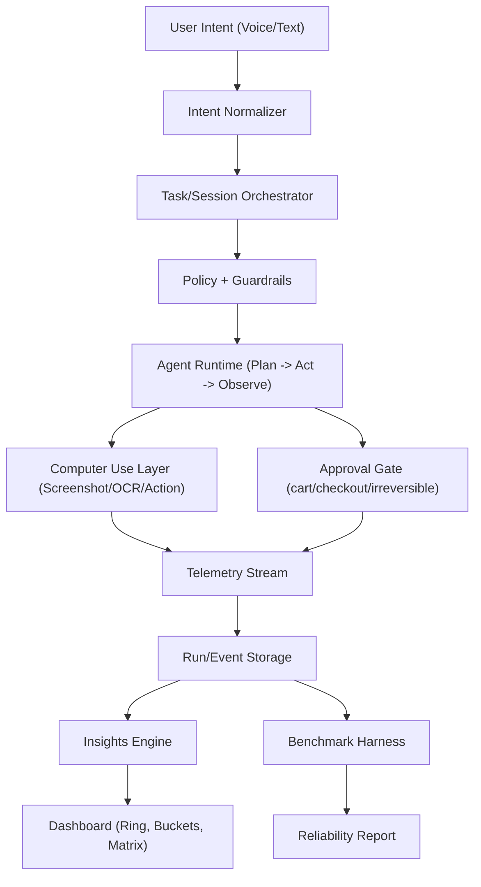
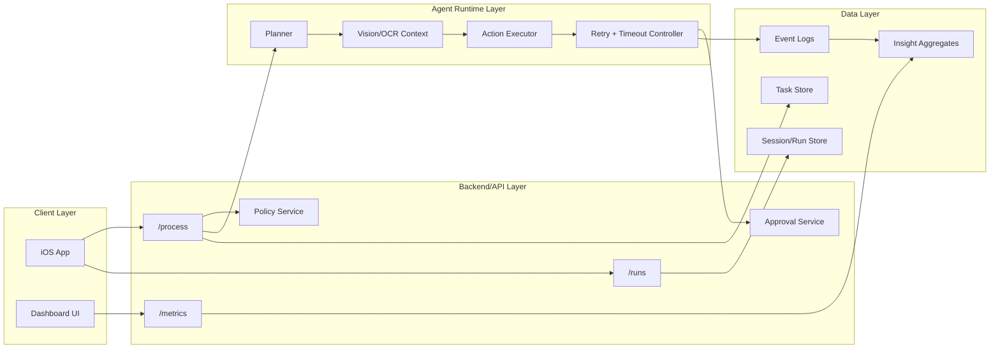
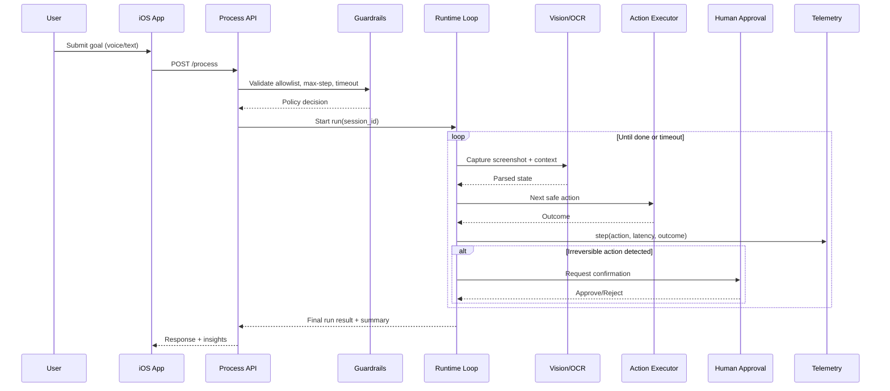

# TimeBite
Previously called CYRA (Creating Your Reality Agent), TimeBite is an Apple Vision Claw-style productivity agent with a measurable eval/benchmark loop for computer-use tasks.


## TL;DR
TimeBite captures user intent (voice/text), plans safe computer actions, runs guarded execution loops, and reports time-reclaimed outcomes through dashboard metrics and benchmark runs.

## Product Goals
- Build an iOS-first agentic productivity experience.
- Enforce safe execution with policy checks and human approvals.
- Benchmark reliability under perturbations (popups, layout shifts, out-of-stock states).
- Quantify value through `minutes_reclaimed` and scenario success metrics.

## AgentBeats Integration (From CYRA Repo)
- Source benchmark repo: [CYRA-AgentBeatsHackathon](https://github.com/erinjerri/CYRA-AgentBeatsHackathon)
- Current CYRA green image: `ghcr.io/erinjerri/cyra-green-agent:latest`
- Demo: [YouTube walkthrough](https://youtu.be/RiCsyp49Qn0)
- Agent profile: [AgentBeats - Create Your Reality](https://agentbeats.dev/erinjerri/create-your-reality)

### Evaluation Status
- CYRA is already registered as a Green Agent with a baseline Purple Agent.
- Leaderboard/eval pipeline is configured in the CYRA repo.
- TimeBite extends the same architecture for productivity and time-reclaimed benchmarking.

### Running Green Agent Container
```bash
docker pull ghcr.io/erinjerri/cyra-green-agent:latest
docker run ghcr.io/erinjerri/cyra-green-agent:latest
```

### After Running Agents (Recommended Flow)
1. Validate run logs and output artifacts (success/failure + telemetry).
2. Update `scenario.toml` participant IDs/env in the leaderboard repo.
3. Trigger assessment workflow from a branch and review generated results.
4. Merge results PR to publish leaderboard updates.
5. Sync key metrics into TimeBite dashboard docs (`minutes_reclaimed`, success rate, unsafe action rate).

### Reuse vs New Docker Image / Agent Registration
- Reuse existing CYRA Green Agent if evaluator contract and benchmark scope are unchanged.
- Publish a new image tag if logic changed (policy, scoring, tool behavior, schema), then update the registered agent image reference.
- Register a new Green Agent only if you are creating a distinct benchmark identity (new domain/leaderboard), not for routine iteration.

## Information Architecture


## System Design


## Agent Loop (Execution + Safety)


## Planned API Surface
| Endpoint | Method | Purpose |
|---|---|---|
| `/process` | `POST` | Start/continue an agent run from structured intent. |
| `/runs` | `GET` | Fetch run history, statuses, and scenario results. |
| `/metrics` | `GET` | Return dashboard metrics (time reclaimed, reliability, safety). |

## Core Data Model (Planned)
| Entity | Key Fields |
|---|---|
| `Task` | `task_id`, `intent`, `constraints`, `priority`, `created_at` |
| `Session` | `session_id`, `user_id`, `start_time`, `end_time`, `status` |
| `Run` | `run_id`, `session_id`, `scenario`, `score`, `duration_ms`, `result` |
| `Insight` | `insight_id`, `session_id`, `minutes_reclaimed`, `bucket`, `created_at` |
| `StepEvent` | `run_id`, `step_index`, `action`, `latency_ms`, `outcome`, `safety_flag` |

## Safety and Compliance Defaults
- Allowlist-based action policy.
- Max steps per run and strict wall-clock timeout.
- Mandatory human confirmation for checkout/cart/final submit.
- Benchmark-time perturbation tests before release freeze.

## Metrics That Matter
- `minutes_reclaimed` per run/day/week.
- Success rate across scored benchmark sessions.
- Unsafe action rate under perturbation.
- Median latency per action and end-to-end run time.

## Quick Start (Boilerplate)
```bash
# 1) Clone
git clone https://github.com/erinjerri/TimeBite.git
cd TimeBite

# 2) Create env file (example)
cp .env.example .env

# 3) Install deps
# npm install

# 4) Run app/api
# npm run dev
```

> Note: this repository is currently documentation-first. Replace placeholder setup commands with your actual stack commands as implementation lands.

## Documentation
- Roadmap checklist: [docs/to-do-list.md](docs/to-do-list.md) (also embedded below).
- Architecture and safety baseline: this README.
